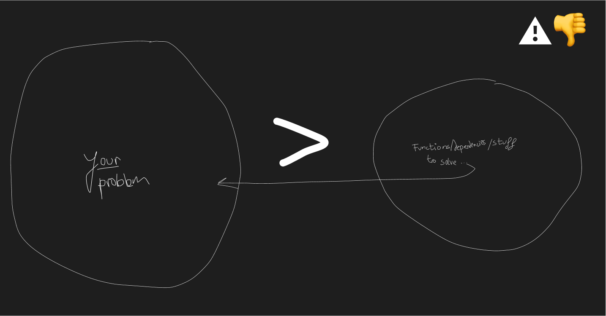

I had to work with a low-value solution. It was complex, dense, with many steps, a specific execution order, dependencies, exceptions, and control points. Not worth describing in detail. You can probably think of something similar and it would apply the same way.

I’ve been thinking about value because in the tangible world it’s relatively easy to detect and measure, at least for basic things. And really, it’s easier to see in the basic ones. If you were thinking of a car, that’s not basic. That’s already tricky territory: part of its value comes from the tangible fact that it gets us from A to B safely, but there is also the intangible side, recognition, validation, and status. We’ll get back to that later, but for now let’s look at something simpler: a plate.

The value of a plate is obvious. It stops us from putting food directly on the table, keeps hard-to-clean surfaces from getting dirty, helps prevent hygiene issues, and so on.

Now, back to that overcomplicated digital solution we used, one that didn’t quite fit naturally.  

**Caveat Applied to Digital Solutions:** the amount of headaches a solution is likely to bring, even at mature development stages.

  
*This is usually how we start framing the topic, isolating problem and solution. We tend to think our solutions are clean, with no hidden costs or carbon footprint. It’s a framework that’s very far from reality.*

Every valuable object comes with a caveat. With a plate, you need to clean it after use. And yes, that leads into another caveat, using the dishwasher 😅 but let’s not go there now.

**Initial problem + solution’s caveat > solution**  
*The solution only makes sense if it requires less effort than handling the problem plus the caveat of the solution combined.*

Simple, right? If to use a plate I had to open a hatch in the ceiling, climb into the attic, bring it down, unpack it, glue porcelain pieces together, wait for them to set, and then clean it, I’d probably end up eating straight off the table.

This says a lot about the weight of a solution’s caveat and how simplification, finding the most direct execution path, keeps that weight in check. Often, by offering a more realistic solution, you keep the caveat from getting out of hand. That’s what you want to keep an eye on.

### There’s No Such Thing as a Caveat-Zero Solution

If it doesn’t exist in the physical world, it doesn’t exist in the digital one either. Friction can be minimal, but it will always be there. Thinking it isn’t is risky. Any app that makes your life easier has already given you extra work or is about to. It depends on things you can’t control, internet connection, battery, whatever. Caveat-zero simply doesn’t exist.

So the mission is to know the range of caveat you’re willing to handle and not step outside of it.

## Why This Frame Matters

You can’t solve a problem without focus, and the problem is that often we define the solution and then keep our focus there. But you could choose between:

- Focus on the problem (how do I solve it?).
- Focus on the solution (how do I make it real?).  
- Focus on the caveat of your solution.

## Other Classic Approaches

Usually, digital products are tackled in phases. I think that’s fine, it keeps the focus on the solution without letting it wander too much.

That’s where v1, v2.0 and so on come from. They work if you set the solution’s value before you even get there. What doesn’t work is moving forward with the solution and then saying, “Oh, makes sense to launch a 2.0 now.”  
(Disclaimer: if that’s the pattern, you might be better off focusing on the caveat instead.)

## The Trap of Perceived Value

I wouldn’t want to finish writing about this without pointing out another problem to watch for when providing solutions. Earlier, I mentioned the car example for a reason. Its value is diluted by ego, recognition, and a sense of belonging, which can easily block us.

We often assign it an unrealistic value. This is even more noticeable in the digital environment. The feeling you have toward your product has nothing to do with what others will feel about it, for several painful reasons:

1. They probably haven’t even tried it yet.  
2. Its reception is heavily tied to trends, completely outside your control. Call it luck if you want, it’s closer to luck than anything else.  
3. The value they give it will almost always be far lower than the one you give it.

This shouldn’t be, and doesn’t have to be, demotivating. It’s simply a way to stay grounded. If you’re going to solve something, it’s better to do it with a mental framework that makes sense for you and your team. This is just one starting point, but I believe it’s applicable to a wide range of solutions, and certainly better than nothing.

Disclaimer: I’m not against enjoying the process of generating solutions or growing them. I’m only saying that when we talk about deliverables, we should know how to detach ourselves from them and be ready to reduce or discard them entirely if the situation calls for it.